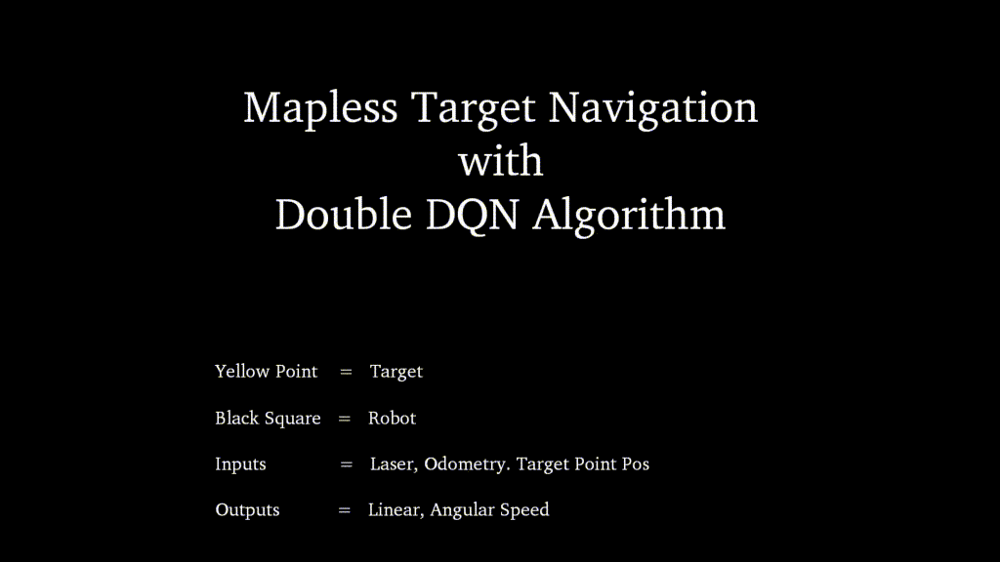
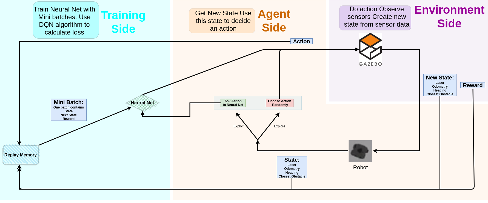

# RL Navigation for Mantis and Turtlebot3




## :scroll: About
Mapless navigation with Double DQN algorithm for [Mantis](https://github.com/yazgit-labs/mantis) and Turtlebot3. The implementation consists of two parts. 

The first part:
* Mainly connects to the **Gazebo(Environment)** and creates an abstraction layer to turn the **Gazebo(Environment)** to an OpenAI environment.
* Can pause and unpause the **Gazebo(Environment)** or restart it.
* Can set a target point randomly and delete or create a target visual model.
* Can teleport **Robot(Agent)** model on the map.
* Can get sensor data from the **Gazebo(Environment)**.
* Includes discrete action definitions.
* Calculates rewards from sensor data. (Check code or references for detail.)
* Calculates episode is done or not. **Robot(Agent)** crashed or reached to target.
* Filter all the calculated data and send it as a new state to **Robot(Agent)**.
* It has two main functions that **Robot(Agent)** use. One is the *reset* and the other is *step*. It's like OpenAI GYM.

There are two different code for Mantis and Turtlebot3. You can find them in *./src* . They start with ```gazebo_``` prefix.

The second part:
* Mainly controls the **Robot(Agent)**.
* Includes the Double DQN algorithm.
* Includes DNN definitions.
* Includes replay memory definition.
* Includes episode definition.
* Can save models or load models from file.
* Can show a live plot about the situation.
* Prints output to the terminal.

There are two different codes for Mantis and Turtlebot3. You can find them in *./src* . They start with the robot name prefix.

Main schema is here:
</img> 

## :floppy_disk: Installation
You can install this implementation in two ways. One is using ready to run docker image that contains everything you need. The other is to setup everything from scratch.

### :whale: The Docker Way
First, you need [Rocker](https://github.com/osrf/rocker). In pure docker, you have to do some extra job to show the X11 window screen of the Gazebo. You also need to optimize NVIDIA if you have one. Rocker does everything automatically.

Setup a Python3 then use pip3 to install rocker. ```pip3 install rocker```. If you can't just check their repo.

Then open a new terminal and execute this:
```rocker --pulse --x11 --nvidia bhctsntrk/mantis-images-rep:mantis-turtlebot3```
and now you have a Ubuntu 18 image that includes everything. Go to ⚙ Run section.

### :building_construction: From Scratch
* Open a terminal in Ubuntu 18 or some other distro that can work with [ROS Melodic](http://wiki.ros.org/melodic).
* :exclamation: If you use different distro maybe you can't install some packages that you will need later like [this](https://packages.ubuntu.com/search?keywords=python3-empy). I haven't tried it with different distros.
* :bangbang: You can also use different ROS versions but you need to be sure that Turtlebot3 or Mantis works on that ROS version.
* Install Python3.6 or different versions of Python3. (I tested with 3.6).
* Install ROS Melodic. :grey_exclamation: This step may seem simple and short, but it will take a long time.
* Run this [script](https://github.com/bhctsntrk/mantis_ddqn_navigation/blob/master/docker_ready.sh). It includes pip and apt codes that install a lot of packages. Replace the parts that write *3.6* in the script if you use a different version of Python3 like 3.7.
* Create a workspace and put [Mantis](https://github.com/yazgit-labs/mantis) in it like this ```/home/user/'your_mantis_workspace_name'/src/mantis/...mantis packages...```. Check [Docs](http://wiki.ros.org/catkin/Tutorials/create_a_workspace) if you don't have any idea bout ROS workspaces.
* Go to workspace dir and build workspace with ```catkin_make```.
* Source the ROS and workspace. Execute(for ROS Melodic) ```source /opt/ros/melodic/setup.bash```. This will source ROS main packages. Execute ```source ~/'your_mantis_workspace_name'/devel/setup.bash``` to source Mantis workspace.
* Check Mantis if it works. Execute ```roslaunch mantis_gazebo one_robot_launch.launch```. This will open a Gazebo with Mantis bot. Then press ```Ctrl+c``` and close.
* Check Turtlebot3. Execute ```export TURTLEBOT3_MODEL=waffle``` because we will use waffle version of Turtlebot3. Then ```roslaunch turtlebot3_gazebo turtlebot3_empty_world.launch``` and check if the Gazebo with Turtlebot3 opens. If opened and worked press ```Ctrl+c``` and close.
* Open ```/opt/ros/melodic/share/turtlebot3_description/urdf/turtlebot3_waffle.gazebo.xacro``` this with some editor. Make ```<samples>24</samples>```. Because 360 laser point is too much for our neural net.
* Do same to Mantis bot ```/root/mantis_ws/src/mantis/mantis_description/urdf/laser/hokuyo.xacro```.
* Download this repo that contains special algorithm implementation. Put it to the same place with other mantis packages. Here is mine: ```/root/mantis_ws/src/mantis/mantis_ddqn_navigation```.
* Build and source workspace again.
* Now you can execute this ```roslaunch mantis_ddqn_navigation gazebo_turtlebot3_maze1.launch gui:=True``` or this ```roslaunch mantis_ddqn_navigation gazebo_mantis_maze1.launch gui:=True``` and it starts our bots in maze1 map. If opened and worked press ```Ctrl+c``` and close.
* Lastly, we need to build tf package from scratch because it is not working with Python3 in default.
* Create a new workspace for tf package like ```mantis_ws_py3tf```.
* Execute:
```
mkdir -p ~/mantis_ws_py3tf/src; cd ~/mantis_ws_py3tf
catkin_make
source devel/setup.bash
wstool init
wstool set -y src/geometry2 --git https://github.com/ros/geometry2 -v 0.6.5
wstool up
rosdep install --from-paths src --ignore-src -y -r
```
and execute to build tf package (Replace the parts that writes *3.6* in script if you use different version of Python3 like 3.7): 
```
catkin_make --cmake-args \
            -DCMAKE_BUILD_TYPE=Release \
            -DPYTHON_EXECUTABLE=/usr/bin/python3 \
            -DPYTHON_INCLUDE_DIR=/usr/include/python3.6m \
            -DPYTHON_LIBRARY=/usr/lib/x86_64-linux-gnu/libpython3.6m.so
```
* Source workspace.
* :partying_face: Congratulations you came this far. The setup is completed.

## ⚙ Run
After setup envrionment, you can train your bot. I consider that you are using docker if not then you have to replace some parts in scripts below(like workspace directory name) for your setup.

* Source envrionments:
* ```source opt/ros/melodic/setup.bash```
* ```source /root/mantis_ws/devel/setup.bash```
* ```source /root/mantis_ws_py3tf/devel/setup.bash```
* Go to *mantis_ddqn_navigation/src*  ```roscd mantis_ddqn_navigation/src/```. If this won't work then you have to execute source codes again.
* There are three maze map *(maze1, maze2, maze3)*. Let consider that you work on maze1 with Turtlebot3.
* Open *gazebo_turtlebot3_dqlearn.py* with editor like vim. Change SELECT_MAP parameter to ```SELECT_MAP = "maze1"```.
* Open *turtlebot3_lidar_dqlearn.py*. There are a lot of parameters you have to set. Default parameters has been set to test 8262nd episode that I trained. You can find model files inside */tmp/mantisModel* in docker image.
* Check *mantis_lidar_dqlearn.py* because it's parameters has been set for training. Copy parameters from there to set turtlebot3 parameters for trainining.
* All parameters have a comment line so it will be easy if you know DQN implementations.
* Launch simulation in background with ```roslaunch mantis_ddqn_navigation gazebo_turtlebot3_maze1.launch gui:=False&```.
* ```gui:=False``` option will start Gazebo without GUI client. ```&``` execute scripts in background in shell. Without GUI client rendering, training will be faster.
* Launch Agent controller with ```python3 turtlebot3_lidar_dqlearn.py&```. If you get ```ImportError: dynamic module does not define module export function (PyInit__tf2)``` error source py3tf again.
* If you want to stop training execute ```fg``` and get *python3 turtlebot3_lidar_dqlearn.py* to foreground then press ```Ctrl+c``` and close.
* If you want to see simulation execute ```gzclient``` and Gazebo GUI client window will be shown. Then you can close it with ```Ctrl+c```. Remember this won't close the main Gazebo server. If you want to close Gazebo server then *fg* to *roslaunch mantis_ddqn_navigation gazebo_turtlebot3_maze1.launch gui:=False* and press ```Ctrl+c```.

## :twisted_rightwards_arrows: Using w/ Different robots or versions
You can use this implementation for different versions or robots but you have to change a lot of things:
* If you want to use different ROS versions you should be able to run Turtlebot3 or Mantis with that version.
* There is also another problem that different ROS versions use different Gazebo versions(not always). The codes that controls Gazebo in this implementation tested with Gazebo 9.
* If you want to use different Linux Distro you should be able to run ROS Melodic with that version.
* If you want to use different a robot then you have to change Agent and Gazebo control codes in this repo. I add a lot of comment lines so if you read carefully you can change it for different robots. Of course, you need to know ROS nodes, messages, services a little.

## :ballot_box_with_check: To-Do List
* Add Pytorch Implementation.
* Add training graphs.
* Test on a different robot.

## :spiral_notepad: References
* [Robotis page about RL w/ Turtlebot](https://emanual.robotis.com/docs/en/platform/turtlebot3/ros2_machine_learning/)
* [Gazebo Gym](https://github.com/erlerobot/gym-gazebo)
